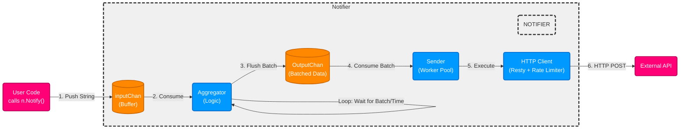

# Task

Write a library that implements an HTTP notification client. A client is
configured with a URL to which notifications are sent. It implements a
function that takes messages and notifies about them by sending HTTP
POST requests to the configured URL with the message content in the request
body. This operation should be non-blocking for the caller.

A great number of messages might arrive at once, so make sure to handle
spikes in notification activity and don’t overload the event-handling service
or exhaust your file descriptors. But be efficient and don’t just send requests
serially.

Allow the caller to handle notification failures in case any requests should
fail.

# Notifier

This library implements the HTTP notification client.
For plug and play experience, I would recommend to use `func Default(url string) *Notifier` func to create new Notifier.

Here is a simple example of how to set up `Notifier`:

```golang
package main

import "github.com/jadegopher/notifier"

func main() {
	n := notifier.Default("your url")

	n.Start()

	n.Notify("hello_world")
	n.Stop()
}
```

You also can check `/cmd/main.go` as an example.

## Things that you need to know if you use Default config

By Default:

- Rate limiting strategy drops all requests over set limit;
- Only requests with Status Code **500** are retried max **3** times;
- Notifications are sent as HTTP POST request with JSON body `{"messages":["hello_world", "hello_world"]}`.

## Architecture

The `Notifier` consists of several components:

- Aggregator
- HTTP client
- Sender

Here is a digram that shows the interaction of mentioned components:



### 1. Push string

The main idea that when User's code is invoking `Notify("msg")` function we put `"msg"` into a buffered channel called 
`inputChannel`. Such decision fits the requirement of async notifications processing.

### 2. Consume

On the next step the `Aggregator` consumes notifications and stores into `Batch`. 
By batching notifications, we reduce the number of HTTP requests that are needed to be sent. 

Aggregator is a single instance component that cannot be scaled. 

The benchmark shows next numbers when a single notifier handles parallel requests:

```text
goos: darwin
goarch: arm64
pkg: notifier/internal
cpu: Apple M4
BenchmarkAggregator_Handle_Parallel
BenchmarkAggregator_Handle_Parallel-10    	 7036036	       196.4 ns/op	 539.63 MB/s	      39 B/op	       0 allocs/op
PASS

Process finished with the exit code 0
```

### 3. Flush Batch

Then `Batch` is flushed into `outputChannel` on **overflow** condition or by **timer** condition. 
Those parameters can be configured.

Also, `Batch` can be flushed on graceful shutdown, but we'll talk about this later.

### 4. Consume Batch

`Notifier` has static worker pool of **N** `Senders` that are responsible to send batched notifications 
to the configured URL via HTTP client.

We need to scale `Senders` because usually HTTP requests take meaningful amount of time to complete.

### 5. Execute

By default `Sender` marshall notifications into JSON body of POST request and sends them by using 
[resty](https://github.com/go-resty/resty) client.

This client implements automatic retries of failed requests and also has included rate limiting feature. 

## Configuration

You can configure a lot:

- Logger. Just assign your logger that fits to `Logger` interface to `DefaultLogger` global variable;
- Error handler for `DefaultHTTPClient` to change error handling logic of HTTP responses;
- Resty client for `DefaultHTTPClient`;
- If you don't like `DefaultHTTPClient` you can write your own HTTP client. In this case you need to implement 
this interface:
```go
type HTTPClient interface {
	Do(ctx context.Context, req *http.Request) (*http.Response, error)
}
```
- Function `senderFunc`. If you don't like a messaging format, you can implement your own `senderFunc`;
- And other parameters that passed to `NewNotifier` function.


## Graceful shutdown

Graceful shutdown performed if User calls `Stop()` function. After it `inputChan` closed and 
`Aggregator` process all notifications from `inputChan`. If no notifications left in `inputChan` `Aggregator`
flushes the last `Batch` and sends it to `outputChan` and close it too. 
Then all `Senders` process batches that left in `outputChan` and finish their job. 

At this point graceful shutdown procedure for `Notifier` completed and only then `Stop()` function will return.